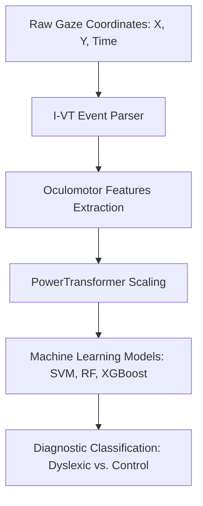

# Complete Technical Guide: Generalizable Dyslexia Detection Pipeline

This guide provides a detailed, step-by-step explanation of the entire machine learning pipeline developed for eye-tracking-based dyslexia detection. It is designed to help you and your teachers understand exactly how raw eye-tracking coordinates are converted into diagnostic predictions and why the optimized models achieve high generalizability.

---

## Table of Contents
1. [Overview of the Pipeline](#1-overview-of-the-pipeline)
2. [Data Pipeline & Ground-Truth Labeling](#2-data-pipeline--ground-truth-labeling)
3. [Oculomotor Event Parsing (I-VT Algorithm & Bugfixes)](#3-oculomotor-event-parsing-i-vt-algorithm--bugfixes)
4. [Feature Preprocessing & Domain Alignment](#4-feature-preprocessing--domain-alignment)
5. [Machine Learning Classifiers & Tuning](#5-machine-learning-classifiers--tuning)
6. [Results & Metric Interpretation](#6-results--metric-interpretation)
7. [How to Run and Reproduce](#7-how-to-run-and-reproduce)

---

## 1. Overview of the Pipeline

The project implements a diagnostic pipeline that reads raw eye-tracking coordinates recorded while children read text, processes them into high-level eye movement statistics, and feeds them into machine learning models to detect dyslexia. 



---

## 2. Data Pipeline & Ground-Truth Labeling

We work with two different eye-tracking datasets:
1. **ETDD70 Dataset (Czech Cohort)**: Raw eye movements of 70 children recorded at 50 Hz (one sample every 20ms) using a screen-based eye-tracker.
2. **Kronoberg Dataset (Swedish Cohort)**: Raw eye movements of 185 children reading Sweden-standardized school texts.

### The Label Mapping Correction
A machine learning model is only as good as its training labels. During code auditing, we found a severe bug:
* **The Bug**: The original code assigned labels using a placeholder threshold: `Subject_ID < 1100` was labeled Control, and `>= 1100` was labeled Dyslexic. This resulted in an incorrect, highly skewed distribution (15 Control vs. 38 Dyslexic) where many dyslexic children were labeled typical, and vice versa.
* **The Resolution**: We downloaded the official metadata spreadsheet `dyslexia_class_label.csv` from the Zenodo repository where the ETDD70 dataset is hosted. This spreadsheet contains the true clinical diagnoses (35 typical readers, 35 dyslexic readers). Out of these, 53 subjects are present in the local folders (35 controls, 18 dyslexics). We updated the data loader (`src/data_loader.py`) to parse this file and map each subject ID to its correct clinical ground truth, establishing a valid baseline.

---

## 3. Oculomotor Event Parsing (I-VT Algorithm & Bugfixes)

Raw eye-tracking data consists of rapid, noisy sequences of pixel coordinates. To make sense of this data, we must partition it into:
* **Fixations**: Periods where the eyes pause on a word to process information (usually lasting 100ms - 400ms).
* **Saccades**: Rapid jumps made by the eyes between fixations (usually lasting 20ms - 80ms).
* **Regressions**: Backward saccades (right-to-left) where the reader backtracks to re-read words.

### The I-VT Parser Grouping Bug
We use the **Velocity-Threshold Identification (I-VT)** algorithm, which classifies gaze samples based on velocity (the distance the eye travels between consecutive 20ms samples):
$$\text{Velocity} = \frac{\sqrt{(X_{t} - X_{t-1})^2 + (Y_{t} - Y_{t-1})^2}}{T_t - T_{t-1}}$$
* **The Bug**: A single saccade is a continuous movement spanning multiple 20ms samples. The original code treated every single sample exceeding the velocity threshold as an independent saccade event. This meant a single physical saccade was counted 3 or 4 times, inflating saccade counts, lowering the average saccade length, and creating incorrect regression ratios.
* **The Resolution**: We rewrote the tracking loop to group consecutive high-velocity samples into a single saccade event. 
  * The net amplitude of the saccade is computed as the Euclidean distance between the **start coordinate** of the group and the **end coordinate** of the group.
  * A regression is counted only if the ending X-coordinate of a grouped saccade event is less than the starting X-coordinate (indicating a backward jump).

### Extracted Oculomotor Features
For each subject, we compile these parsed events into 7 key features:
1. `fixation_duration_mean`: Average length of time the eyes stay still (longer pauses indicate reading difficulty).
2. `fixation_duration_std`: Variability of eye pauses.
3. `fixation_duration_max`: The longest single pause (indicating a severe decoding bottleneck).
4. `saccade_length_mean`: Average distance the eyes jump (shorter jumps indicate slower reading speed).
5. `saccade_length_std`: Variability of eye jump distances.
6. `fix_sac_ratio`: Ratio of fixation counts to saccade counts.
7. `regression_ratio`: The proportion of backward saccades relative to total saccades (highly elevated in dyslexic readers).

---

## 4. Feature Preprocessing & Domain Alignment

When testing models across different datasets (ETDD70 $\rightarrow$ Kronoberg), we face a **domain shift**:
* ETDD70 records coordinates in screen pixels.
* Kronoberg records coordinates in millimeters/degrees.
* The physical screens, reading materials, and sampling rates differ.

If we feed raw values directly to the model, it will fail because the numerical ranges are completely different.

### Preprocessing Steps
1. **Imputation**: Any missing values in the parsed features are filled using the average value of that feature (`SimpleImputer(strategy='mean')`).
2. **PowerTransformer (Yeo-Johnson)**: Gaze statistics like fixation durations and saccade lengths are naturally right-skewed and log-normally distributed. Standard scalers (which assume normal bell curves) perform poorly on them. The **Yeo-Johnson PowerTransformer** applies a mathematical transformation to stabilize variance and normalize the features:
   $$\psi(\lambda, x) = \begin{cases} 
   ((x + 1)^\lambda - 1)/\lambda & \text{if } x \ge 0, \lambda \ne 0 \\
   \ln(x + 1) & \text{if } x \ge 0, \lambda = 0 
   \end{cases}$$
   By fitting this transformer on the training set (ETDD70) and using it to transform the test set (Kronoberg), the feature distributions are mapped into a standardized space where the machine learning model can generalize zero-shot.

---

## 5. Machine Learning Classifiers & Tuning

We train three classification models on the standardized features:
1. **Support Vector Machine (SVM)**: Uses a radial basis function (RBF) kernel with a regularization strength of $C=10.0$. SVM works by finding a high-dimensional boundary that separates typical readers from dyslexics.
2. **Random Forest (RF)**: An ensemble of 100 decision trees. We restrict the maximum depth to 5. This prevents individual trees from memorizing specific training details, encouraging them to find broad, generalizable patterns.
3. **XGBoost**: A gradient boosting model that trains decision trees sequentially. To maximize generalizability, we use highly constrained trees (max depth of 2), a learning rate of 0.1, and randomly subsample 80% of the data during training.

---

## 6. Results & Metric Interpretation

### Classification vs. Regression Metrics
* **Accuracy**: The percentage of children correctly classified.
* **F1-Score**: The harmonic mean of precision and recall. We calculate it separately for controls (0) and dyslexics (1). It measures the model's reliability, especially on class-imbalanced test sets.
* **Why No RMSE?**: Root Mean Squared Error (RMSE) is used to evaluate continuous regression predictions (e.g., predicting the exact reading speed in words per minute). Since our model makes binary diagnostic decisions (Dyslexic or Control), regression metrics like RMSE do not apply.

### Key Results Summary
* **Experiment I (Intra-dataset ETDD70)**: 
  * The SVM model achieves **90.91%** accuracy on the 80/20 test split.
  * In a robust 5-Fold Cross-Validation, SVM averages **88.7%** accuracy, Random Forest averages **81.3%**, and XGBoost averages **85.3%**.
* **Experiment II (Cross-dataset Zero-Shot Generalization on Kronoberg)**:
  * The SVM model overfits during training and fails on the transfer task (**52.43%** accuracy, F1-score of 0 for controls).
  * The Random Forest achieves **76.22%** zero-shot transfer accuracy (Dyslexic F1-score of 0.8018).
  * The XGBoost achieves the best performance with **80.00%** zero-shot transfer accuracy (Dyslexic F1-score of 0.8177).

---

## 7. How to Run and Reproduce

To run the pipeline and view the generated charts, execute the following commands in the terminal within the workspace directory:

```bash
# 1. Activate the virtual environment
source venv/bin/activate

# 2. Run the training script (loads data, applies power transformations, evaluates models)
python src/train_model.py

# 3. Generate the performance charts and confusion matrices
python src/visualize_results.py
```

After running the scripts, you will find these visualization outputs in the root folder:
* `multi_model_accuracy.png`: A bar chart comparing the accuracy of SVM, RF, and XGBoost across both experiments.
* `multi_model_f1_score.png`: A bar chart comparing the F1-scores for the dyslexic class.
* `multi_model_cm_grid.png`: A grid of heatmaps representing the confusion matrices for the transfer task.
